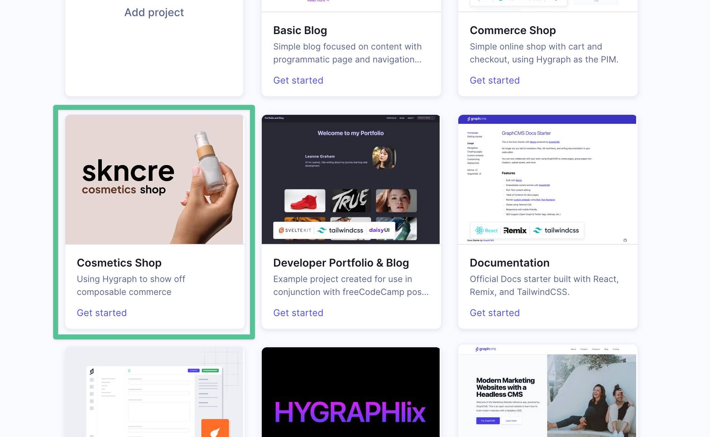
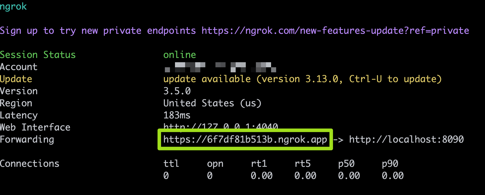
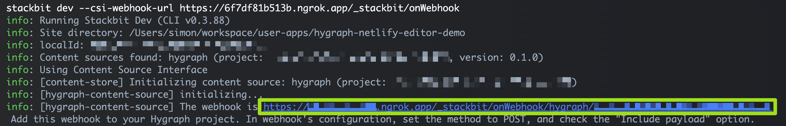
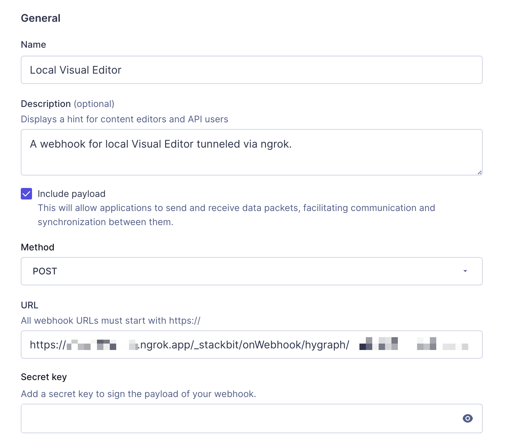

## Hygraph with Netlify Visual Editor 

### How to run locally

1. Create Hygraph project from "Cosmetics Shop" (skncre) template.

    <p align="center"></p>

2. Clone this repo.

3. Install dependencies:

   ```bash
   npm install
   ```

4. Update `.env` file with values from Hygraph project settings:

   1. `HYGRAPH_PROJECT_ID`: Hygraph project ID.
   2. `HYGRAPH_REGION`: Hygraph project region.
   3. `HYGRAPH_ENVIRONMENT`: Hygraph project environment.
   4. `HYGRAPH_ENDPOINT`: Hygraph content API endpoint URL.
   5. `HYGRAPH_ASSET_UPLOAD_API`: Hygraph management API endpoint URL.
   6. `HYGRAPH_MANAGEMENT_API`: Hygraph management API endpoint URL.
   7. `HYGRAPH_MANAGEMENT_TOKEN`: Hygraph management token.

5. Open a terminal window and run Next.js dev server. This will start a local dev server on http://localhost:3000. Open it in your browser and validate that the site is working properly and renders the content from Hygraph.

   ```bash
   npm run dev
   ```

   Try updating some content in Hygraph, then reload the page to see the changes.

6. Open a 2nd terminal and create a public tunnel to your machine's 8090 port with [ngrok](https://ngrok.com/). A public tunnel is needed to allow the local Visual Editor receive webhooks from Hygraph:
   
   ```bash
   ngrok http 8090
   ```

   Take a note of the public URL address created by ngrok, it should match a pattern similar to https://HASH.ngrok.app. Keep this terminal window opened.

   <p align="center"></p>

7. Open a 3rd terminal and install `@stackbit/cli`:

   ```bash
   npm i -g @stackbit/cli
   ```

8. Start Netlify Visual Editor by running the following command. Set the `--csi-webhook-url` argument to the ngrok's public URL address with the `/_stackbit/onWebhook` path.

   ```bash
   stackbit dev --csi-webhook-url https://HASH.ngrok.app/_stackbit/onWebhook
   ```

   This command will print the final webhook URL in the following format:

   ```text
   https://HASH.ngrok.app/_stackbit/onWebhook/hygraph/HYGRAPH_PROJECT_ID
   ```

   <p align="center"></p>

   Add this webhook to your Hygraph project. In webhook's configuration, set the method to POST, and check the "Include payload" option. Leave all the other settings empty.

   <p align="center"></p>
   
9. Open http://localhost:8090/_stackbit in your browser and start editing your site visually.
